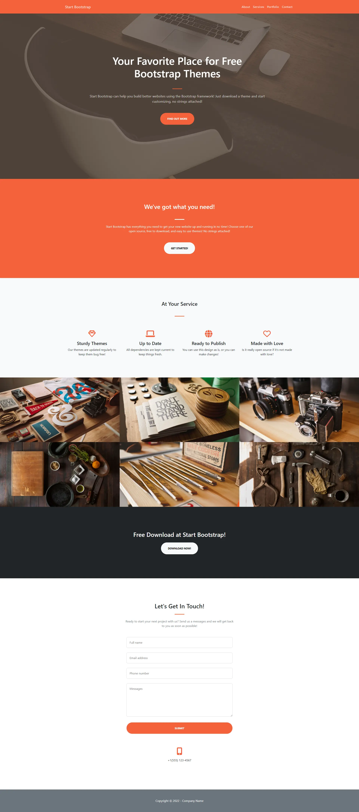
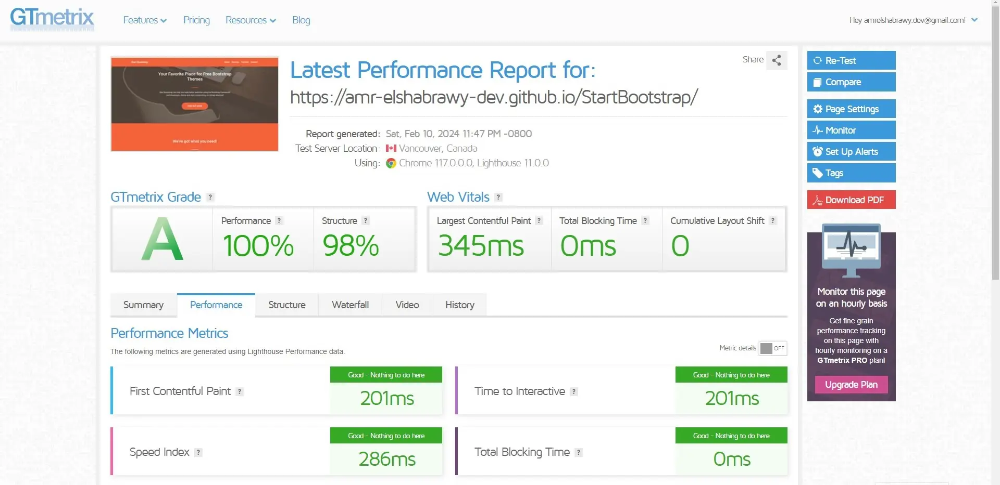

<h1 align="center">Start Bootstrap</h1>

### 👁️ Project Preview

- [Live Preview 👉 https://amr-elshabrawy-dev.github.io/StartBootstrap](https://amr-elshabrawy-dev.github.io/AkiraStore)

- [Github Repo 👉 https://github.com/Amr-Elshabrawy-Dev/StartBootstrap](https://github.com/Amr-Elshabrawy-Dev/AkiraStore)
  - 🚩 For any reason <a target="_blank" href="mailto:amrelshabrawy.dev@gmail.com">contact me.</a>

---

### 📝 Project Description & features

- It's a landing page used to practice HTML5, CSS3, Bootstrap.

---

### 🛠️ Project Tools

1. HTML5.

1. CSS3.

1. Bootstrap.

1. Font Awesome.

1. [Squoosh](https://squoosh.app/) is an online tool for image compression web app that reduces image sizes through numerous formats.

1. [GTmetrix](https://gtmetrix.com/) is an online tool for customers to easily test the performance of their webpages.

---

### ✨ Project Skills applied

1. Practice Building UI using HTML CSS Bootstrap.

1. Use Bootstrap package Components.

1. Font Awesome pack for providing icons.

1. Compression images using [Squoosh](https://squoosh.app/) tool.

1. Test the performance of the webpage after deploy by using [GTmetrix](https://gtmetrix.com/).

---

### 🧪 Project performance test

Test the performance of the webpage after deploy by using [GTmetrix](https://gtmetrix.com/).

---

### 👋 Get In Touch

- [🌐 Website 👉 https://amr-elshabrawy-dev.github.io](https://amr-elshabrawy-dev.github.io)
- [👔 LinkedIn 👉 https://www.linkedin.com/in/amr-elshabrawy-dev](https://www.linkedin.com/in/amr-elshabrawy-dev)
- [🌟 Github 👉 https://github.com/Amr-Elshabrawy-Dev](https://github.com/Amr-Elshabrawy-Dev)
- [📧 Gmail 👉 amrelshabrawy.dev@gmail.com](mailto:amrelshabrawy.dev@gmail.com)
- [🐤 Twitter 👉 https://twitter.com/AmrElshbrawy217](https://twitter.com/AmrElshbrawy217)
- [☎️ Whatsapp 👉 (+20) 120-254-6653](https://api.whatsapp.com/send/?phone=%2B2001202546653&text&type=phone_number&app_absent=0)

---

<a target="_blank" href="https://amr-elshabrawy-dev.github.io">

 2023 &copy; Amr Elshabrawy 

</a>

